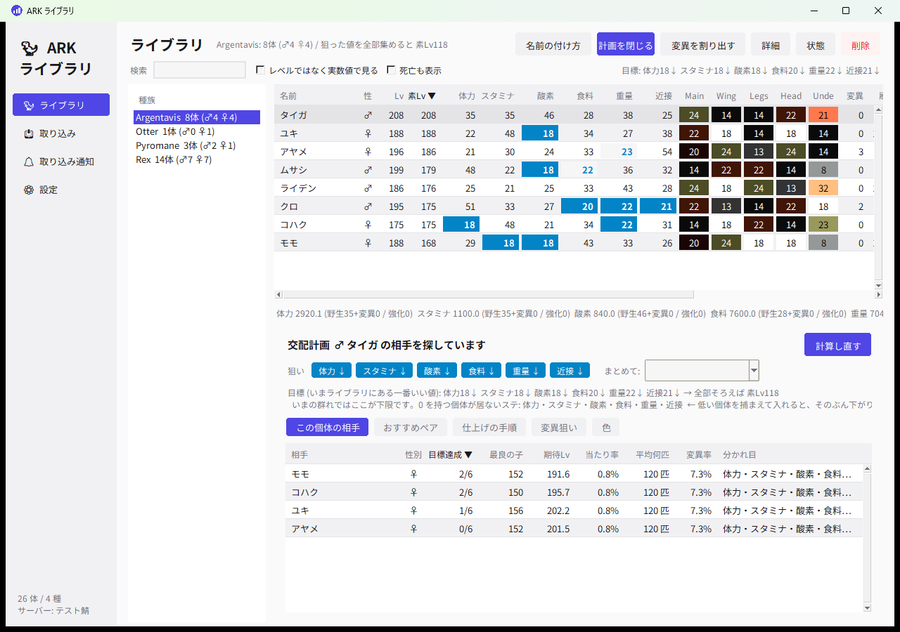

# ARK ライブラリ

ARK: Survival Ascended の生物を、ゲーム内の「恐竜のエクスポート」から取り込んで
管理する Windows デスクトップアプリ。ステータスのレベル内訳を割り出して一覧にし、
**最高ステータスの個体を作るにはどれとどれを掛け合わせればいいか**を出す。



エクスポートした瞬間に自動で取り込み、名前をクリップボードに入れて、
画面にステータスを数秒だけ出す。自己ベストが出たら音で知らせる。


## 入れかた

[リリース](https://github.com/Simohayhe/ark-library/releases/latest) から好きなものを。

| ファイル | どんなとき |
|---|---|
| `ArkLibrary-x.y.z-setup.exe` | **ふつうはこれ**。スタートメニューに入り、Windows起動時に自動で開く設定もできる |
| `ArkLibrary.exe` | インストールしたくないとき。1 ファイルで動く |
| `ArkLibrary-x.y.z-win64.zip` | フォルダ版。展開して置くだけ。起動がいちばん速い |

インストーラは**管理者権限を要求しない** (`%LOCALAPPDATA%\Programs\ArkLibrary` に入る)。
アンインストールしても、取り込んだライブラリは残る (消すかどうかは聞かれる)。

更新は **設定 → 更新を確認** から。新しい版があればその場で入れ替えて再起動する。
インストーラで入れたなら setup.exe を、そうでなければ exe か zip を自動で選ぶ。

ソースから動かす場合 (Python 3.12 + tkinter のみ。追加ライブラリなし):

```
python ark_library.py        (または 起動.bat)
```

---

## 使い方

### 1. サーバーの倍率を登録する (最初に 1 回)

「設定」→「自分のサーバーから読む」。このPCの `C:\ArkServers\<マップ名>\...\Game.ini`
を自動で見つけて読む。他所のサーバーで ini が貰えないときは、**表を直接書き換える**
(たとえば GorillaArk は「公式相当 ＋ 重量のテイムLv だけ 2 倍」)。

**ここが合っていないとステータスの逆算が必ずずれる**(解なしになる)。
エクスポートに入っているのは表示値だけで、レベルの内訳は入っていないため。

### 2. ゲーム内でエクスポートする

生物のインベントリを開いて「恐竜のエクスポート」。ファイルはここに増える。

```
C:\Program Files (x86)\Steam\steamapps\common\ARK Survival Ascended\ShooterGame\Saved\DinoExports\
```

### 3. 取り込む

既定で**自動取り込みが入っている**ので、ゲーム内でエクスポートすれば勝手に入る。
まとめて読み直したいときは「取り込み」→「新しいぶんを取り込む」。
フォルダは自動検出する。

同じ生物を何度エクスポートしても、ゲーム内 ID で同じ個体と分かるので重複しない
(内容は新しい方に更新される)。

### 4. 見る・組ませる

**ライブラリ**の画面に全部ある。種族ごとの一覧で、列ごとの最高値に色が付く
(行をダブルクリックで詳細)。**「交配計画」** を押すと同じ画面の下に
「おすすめペア」が出る。誰と誰を掛ければいいかが確率つきで並ぶ。

行を**右クリック**すると、その個体をいじるメニューが出る。

| 項目 | 何をするか |
|---|---|
| ステータスを編集 | 野生 / 変異 / 強化のレベルを直す。ゲーム内の値は計算し直す |
| 色を編集 | 領域ごとに色を選び直す (塗り替えたとき・読み違えたとき) |
| 状態を変える | 生存 / クライオ / アップロード中 / 死亡 |
| この個体を理想個体にする | いまの個体をそのまま目標にする |
| 名前をコピー | ゲーム内に貼る名前をクリップボードへ |
| 削除 | ライブラリから消す (ゲーム内の生物には何も起きない) |


---

## 取り込んだ瞬間にやること

「取り込み通知」画面で設定する。アプリを立ち上げておけば、取り込み画面を開いて
いなくても動く。

### 自動取り込み
DinoExports を 0.2 秒ごとに見張って、増えた瞬間にライブラリへ入れる。
**エクスポートしてから名前がコピーされるまで 0.2〜0.3 秒**ほど。

見張りの負担はほとんどない (500 ファイルあっても 1 周 1.7 ms)。更新時刻を覚えて
おいて、変わったものだけを調べるようにしてある。書き込みの途中を掴んでしまった
ときは、黙って次の周回でやり直す (失敗の音は鳴らさない)。間隔は設定で変えられる。

### 名前をクリップボードへ

    M H47 S24 W37 M26
    ^ 性別          ^ 近接攻撃力のレベル

取り込んだ瞬間にこの文字列を作ってクリップボードに入れる。ゲームに戻って
名前欄に Ctrl+V で貼るだけ。入れるステータス・性別を付けるか・変異の印は
設定で変えられる。レベルは **野生 + 変異** (交配で子に渡る値)。

**種族ごとに変えられる。** ライブラリで種族を選んで「命名規則」を押すと、
その種族だけの決め方を作れる。決めた項目だけが上書きされ、決めなかった項目は
全種族共通の設定に落ちる。

| 種族ごとに決められるもの | 例 |
|---|---|
| 含めるステータス | ダエオドンは食料を入れる / 水生生物は酸素を外す |
| 形式 (ぜんぶ / ゼロだけ / OF) | オーバーフロー系統だけ OF 表記にする |
| 先頭に性別を付けるか | |
| 変異マーク | |

    ダエオドン   M H44 F41 W37 M26     ← 食料を入れた
    Rex (OF系)   M 23                  ← この種族だけ OF 形式
    そのほか     M H44 S20 W37 M26     ← 共通設定のまま

作り方は 3 つから選べる。

| 作り方 | 出てくる名前 | 使いどころ |
|---|---|---|
| ぜんぶ | `M H47 S24 O0 F0 W37 M26` | ふつう |
| ゼロだけ | `M O0 F0` | ゼロ狙いの系統。どこまで掃除できたか一目で分かる |
| OF (変異数) | `M 23 (20/3)` | オーバーフロー系統。変異カウンタと性別だけ |

OF の括弧は父側 / 母側の内訳。どちらが 20 未満かで次に掛ける相手が決まる。

メイグアナやアカティナのように**雌雄の無い種族は `U`** になる。どの個体とも
掛け合わせられるので、交配の相手さがしも U 同士で組む。

ゲーム内で名前が付いていない個体は、この名前でライブラリに登録する
(オフにもできる)。

### オーバーレイ
ゲームの上に数秒だけ出る。既定 5 秒。次を取り込むと前のは即座に消えて
差し替わる。**フォーカスは奪わない**ので、出ている間もそのまま操作できる。

エクスポートしてから **0.1〜0.2 秒**で出る。逆算に時間がかかる個体
(強化レベルを振ったテイム個体など) では、先に「読み込み中…」が出て、
出来たらそのまま差し替わる。

最高記録が出たステータスには印が付く。

| 印 | 意味 |
|---|---|
| ▲ | 今までのライブラリの最高を**超えた** |
| ★ | 今の最高と**同じ** |

ARK の表示設定が「フルスクリーン(専用)」だと Windows の仕様でどんな窓も
上に出せない。「ウィンドウ(フルスクリーン)」にすれば出る。

### 音 (4 種類)

| 場面 | 既定の音 |
|---|---|
| 取り込み成功 | ぽん |
| 取り込み失敗 | ぶぶー |
| 自己ベスト更新 (今までのどれよりも高い) | ファンファーレ |
| いまの最高と同じ | ちりん |

内蔵音はアプリが自分で合成して作るので音源ファイルは要らない。
自分の mp3 / wav に差し替えることもできる。

比べる相手は「同じ種族・同じサーバーの、生きている自分以外の個体」。
同じ生物を何度エクスポートしても、自分自身とは比べないので判定は変わらない。

---

## 交配計画の中身

ライブラリで「交配計画」を押すと開く。タブは 4 つ。

| タブ | 中身 |
|---|---|
| おすすめペア | 全部の組み合わせを総当たり。いちばん使う |
| 仕上げの手順 | 狙った値を 1 匹に集めるまでの段取り |
| 変異狙い | 完成個体を崩さずに変異を足せるペア |
| 色 | 狙った色が出せるペア |

一覧で個体を選ぶと、その個体を含むペアに色が付く。
**「選んだ個体を含むペアだけ」**にチェックを入れれば、その個体の相手だけに絞れる。

### 狙い方 (ステータスごとに 3 段階)

上のチップを押すたびに切り替わる。

| 表示 | 意味 |
|---|---|
| ↑ | **最高**を狙う (体力・近接など) |
| ↓ | **ゼロ**を狙う (酸素・食料など) |
| — | 気にしない |

ゼロ狙いが要るのは、レベル上限に余裕を作りたいときや、変異を乗せる枠を空けたいとき。
「まとめて」から次のプリセットも選べる。

- **最高ステ狙い** … 全部 ↑
- **実用型 (酸素・食料をゼロ)** … 酸素と食料だけ ↓
- **Lv1個体 (全ステゼロ)** … 全部 ↓。まっさらな素体を作るモード

**交配では両親より低い値は出ない**ので、下げられる限界は「いまライブラリにある
いちばん低い値」になる。0 を持つ個体が居ないステータスは画面に出るので、
そこが低い個体を捕まえて入れると、そのぶん下限が下がる。

継承は「**高い方**の親を 55%、低い方を 45%」なので、**ゼロ狙いのステータスは
欲しい方が出る確率が 45%** になる。↑ と ↓ が混ざったペアの確率は
0.55 と 0.45 を掛け合わせて出している。

### おすすめペア
今いる個体の総当たり。並びは「最良の子のレベル」順。

| 列 | 意味 |
|---|---|
| 最高ステ | 最良の場合に、その子がライブラリ最高値をいくつ持つか |
| 最良の子 | 両親の良い方を全部引いたときの素レベル |
| 期待Lv | 平均するとこのくらい (0.55×高い方 + 0.45×低い方) |
| 当たり率 | 最良の子が出る確率。両親で値が違うステータスの数を n として 0.55ⁿ |
| 平均何匹 | 1 ÷ 当たり率。この数だけ孵せば平均 1 匹当たる |
| 変異率 | この交配で変異が 1 回以上起きる確率 |

### イベント色と変異色の見分け

ARK ASA の色 ID は 3 つに分かれている (ASA-values.json の `dyeStartIndex` と
公式 wiki の Color IDs より)。

| ID | 中身 |
|---|---|
| 1〜127 | 生物色。定義があるのは 1〜100 で、101〜127 は欠番 |
| **128〜254** | **染料色。野生には出ない**。変異・染料・イベント飴でのみ付く |
| 255 | 未設定 |

なので **ID が 128 以上なら、種族を見るまでもなく野生の色ではない**。
そのうえで、1〜100 の生物色は種族ごとに「その領域に野生で出る色」が決まって
いる (`colors.json` の `ids`)。そこに無い色が付いていたら、やはり
**野生では出ないはずの色**ということ。出どころは 2 つに分かれる。

| 個体 | 野生パレットに無い色 | 印 |
|---|---|---|
| テイム / 野生 | イベント中に湧いた個体 = **イベント色** | ★ |
| 交配産 | **変異色** (または親から継いだイベント色) | ◆ |

一覧の色の欄に印が付き、行を選ぶと下に
「イベント色: Feathers = DragonGreen0 (45)」のように出る。詳細画面には
6 領域ぶんの色見本と名前が並ぶ。**取り込んだ瞬間のオーバーレイにも出る**ので、
イベント色の個体を捕まえたその場で気づける。

色データが無い種族 (Mod など) は、1〜100 の色については判定しない
(染料色は種族に関係なく分かる)。

染料色の定義 (ID 128〜254 の名前と RGBA) は ARKStatsExtractor の values.json
には入っていないので、公式 wiki から `tools/build_dye_db.py` で取り込んでいる。
取り込み時に生物色 100 色を values.json と突き合わせて検算しており、
100/100 一致を確認済み。

生物色と染料色で **RGBA がまったく同じもの**が 7 組ある (Red と Red
Coloring など)。標準エクスポート (ini) は色を RGBA で持っているので
区別できない。そのときは生物色の方を採る (野生で出るのはそちらなので)。

### 理想個体 (目標)

「この種族はこういう個体が欲しい」を 1 つ決めておくと、一覧に **「理想」列**が出て、
**手持ちがそれに何 % 近いか**が分かる。ライブラリの「理想個体」ボタンから決める
(個体を右クリック →「この個体を理想個体にする」でも決められる)。

| 項目 | % の付き方 |
|---|---|
| ステータス (目標 1 以上) | 足りないぶんだけ下がる。40/50 なら 80%。遠いほど低い |
| ステータス (目標 0) | ゼロ狙い。0 なら満点。群れでいちばん悪い値まで離れると 0% |
| 色 | 合っているかどうかだけ。色に「近い・遠い」は無いので、違えば 0% |

全体の % は項目ごとの平均。行を選べば「足りない: 体力 34/54、Body 橙 → 黄」
のように**何があとどれだけ足りないか**が下に出る。

おすすめペアの表にも「理想」列が出る。こちらは**最良の子がステータスで何 % 届くか**
(子の色は親しだいで決まらないので数えない)。取り込み直後のオーバーレイにも
「理想まで 82%」が出る。

### 仕上げの手順
ライブラリの最高値を **1 匹に集めきる**までの段取り。


1. ステータスごとの最高値の持ち主を拾い、いちばん少ない頭数で全部を賄える
   組み合わせを選ぶ (集合被覆)
2. その個体たちをトーナメント式に掛け合わせる
3. 各手で「必要な最高値が全部そろう確率」を出す

ここでの確率は**最高値に関わるステータスだけ**を数える。最高値に届かない
ステータスがどちらの親から来ても、あとの世代で上書きされるので関係ないため。

### 変異狙い
完成個体を崩さずに変異を足せるペア。変異カウンタが 20 以上の親からは
変異が出にくくなるので、そこも表示する。

### 色
色は**領域ごとに独立して、どちらかの親の色をそのまま**受け継ぐ (半々)。混ざらないし
中間色も出ない。だから狙った色を出すには、その色を持つ親を用意するしかない。

領域ごとに「ライブラリにある色」が色見本で並ぶので、狙う色を押して選ぶと、
その色が出せるペアを確率の高い順に出す。

- 両親ともその色 → **確定** (100%)
- 片方だけ → 五分五分 (50%)
- どちらも持っていない → そのペアでは出せない (一覧に出さない)

### 計算の根拠 (ARK の仕様)

- ステータスごとに独立して、**高い方の親の値を 55%**・低い方を 45% で継承
- 継承されるのは「野生レベル + 変異レベル」。振った強化レベルは渡らない
- 変異は 1 回の交配で最大 3 ロール・各 2.5% → 1 回以上起きる確率 約 7.3%
- 変異が起きるとランダムな 1 ステータスに **+2 レベル**
- 変異カウンタが 20 以上の側からは新しい変異が出にくい

---

## ほかの PC と共有する

ゲーム用 PC で取り込んだ個体を、サーバー用 PC からも同じように見たいとき。
**1 台を「共有元」にして、ほかの PC はそこへ数秒おきに読み書きしに行く**。

    ゲームPC ──┐
               ├─→ 共有元の PC ←→ ひとつのライブラリ
    サーバPC ──┘

各 PC は**自分のデータを持ったまま**動く。つながらないときもいつも通り使えて、
つながったら差分だけをやり取りする。SQLite のファイルをネットワーク越しに
直接開くと壊れることがあるので、そうはしない。

### 使い方

1. **共有元にする PC** (ずっと起動しておく側) で「PC間で共有」→
   「この PC を共有元にする」→ 保存。表示されたアドレスと合言葉を控える
2. **もう一方の PC** で「共有元につなぎに行く」→ アドレスと合言葉を入れて保存
3. ファイアウォールでポートを通す (管理者の PowerShell で 1 回だけ)

```
New-NetFirewallRule -DisplayName "ARK Library 共有" -Direction Inbound -Protocol TCP -LocalPort 8787 -Action Allow -Profile Private
```

画面を出さずに共有元だけを常駐させることもできる。サーバー用 PC でタスクに
登録しておく用。

```
ArkLibrary.exe --serve
```

exe は画面なしでビルドしてあるので、アドレスと合言葉は
`%LOCALAPPDATA%\ArkLibrary\share_info.txt` にも書き出される。

### 友達にも配る (ポート開放なし)

家の中だけなら上のままでいい。友達につないでもらうには外に出す必要があるが、
**ルーターを手でいじらずに済む道が 2 つ**ある。「どこまで届かせるか」で選ぶ。

| やり方 | 中身 | 向き / 不向き |
|---|---|---|
| 家の中だけ | LAN の中だけに配る | 既定。いちばん安全 |
| Cloudflare トンネル | ホストから**外へ出ていく接続**だけで済ませる。`https://〜.trycloudflare.com` が貰える | ルーターに触らない。CGNAT でも通る。`cloudflared` が要る (画面のボタンから winget で入れられる)。URL は起動のたびに変わる |
| UPnP でポートを開ける | ルーターに「このポートを通して」と自動で頼む | 追加のソフトは不要。ただし**ポートが世界に見える**。ルーターを再起動すると転送が消える |

どちらも合言葉で守る前提。合言葉なしでは外に出さないこと。

### 合言葉は 2 種類

| 種類 | できること |
|---|---|
| 管理者 | 読みも書きもできる。自分のもう 1 台や、任せる相手に |
| メンバー | **読むだけ**。書き込みは 403 で弾かれる。友達に配る用 |

人ごとに発行しておくと、**やめた人のぶんだけ消せる**。誰が最後にいつ来たかも
共有元の画面に出る。「つなぎ方をまとめてコピー」を押すと、アドレスと合言葉を
入れた案内文ができるので、そのまま送れる。受け取った側は「貼り付けて読み取る」で
アドレスと合言葉が入る。

合言葉は 36 文字種 × 14 桁 (≒ 72 ビット)。照合は `hmac.compare_digest`。

### 何が揃って、何が揃わないか

| 共有する | 共有しない (その PC のもの) |
|---|---|
| 取り込んだ個体 (レベル内訳・色・血統) | 取り込みフォルダ |
| 手で付けたメモ・タグ・状態 (死亡など) | 画面のテーマ・音量・オーバーレイの設定 |
| 種族ごとの理想個体・狙い・名前の付け方 | ウィンドウの大きさ |
| サーバー倍率のプロファイル | 倍率プロファイルの ini ファイルのパス |

### 突き合わせ方

個体はゲーム内の **DinoID** で同じものとみなし、**あとから書いた方**を残す。
個体のデータはほぼ動かない事実なので、これでまず困らない。消した個体は
「消した記録」も配るので、向こうから戻ってこない。

受け取った行をそのまま送り返すと 2 台で延々とやり取りし続けてしまうので、
「この行はこの時刻の状態で貰った」と覚えておいて、こちらで触っていなければ
送らない。時計がずれていても効くように、時刻の大小ではなく一致で見ている。

合言葉 (トークン) が合わないものは弾く。LAN か VPN の中で使う前提。

## 取り込めるファイル

| 種類 | 拡張子 | レベルの内訳 |
|---|---|---|
| ARK 標準の「恐竜のエクスポート」 | `.ini` | 入っていない → 表示値から逆算する |
| Export Gun (Mod) | `.sav` / `.json` | **入っている** → 逆算不要で確実 |

Export Gun のサーバー倍率ファイルも読める (設定 →「Export Gun の倍率ファイル」)。

### 逆算について知っておくこと

- **交配産**はテイム効率 100% 固定なので素直に解ける。
- **テイム個体**は効率がファイルに入っていない。効率が効くステータス
  (体力・近接) の表示値から逆算して当てにいく。
- まれに**レベルの内訳が一つに決まらない**ことがある (表示値が丸められているため)。
  その個体は一覧で色が変わり、詳細に警告が出る。Export Gun で取り直せば確定する。
- **変異カウンタ (何回変異したか)** は、どちらのエクスポートにも入っている
  (父側・母側の 2 つ)。名前の「OF」モードはこれを使う。
- **どのステータスが変異したか**は入り方が違う。
  - Export Gun … ステータスごとの変異レベルが**そのまま**入っている
  - 標準エクスポート … 入っていない。両親がライブラリに居れば
    「親より 2 レベル高い = そこに変異」と**取り込み時に自動で**割り出す。
    居なければ野生レベル扱い。レベルの合計は変わらないので、交配プランの
    結果には影響しない。
    子を先に取り込んでしまったときは、ライブラリ画面の
    **「変異を割り出す」**ボタンで後からまとめて割り出せる。

---

## 実機での確認

実際のエクスポート (ASA / 日本語クライアント) で確認済み。

```
[Dino Data]  … DinoID1/2, DinoClass(末尾 _C), bIsFemale, TamerString, TamedName,
                ImprinterName, BabyAge, CharacterLevel, DinoImprintingQuality
[Colorization]          … ColorSet[0..5]
[Max Character Status Values] … 12 行。**キー名は日本語**(体力/スタミナ/…)で並び順が意味を持つ
[Dino Ancestry]         … DinoAncestorsCount, DinoAncestorsMale
```

ここで分かった注意点:

- セクション名は英語のまま、**キー名だけ翻訳される**。だから並び順で読む。
- `BabyAge=1` は**成体のテイム個体にも書かれる**。これを交配産の印にしてはいけない。
- 近接攻撃力・移動速度は 100% からの増分 (`近接攻撃力=1.4627` → 246.3%)。

確認に使った個体 (カワウソ Lv211、名前が `F H47 S24 W37 M26`) は
`tools/fixtures/real_asa_otter.ini` に置いてあり、`tools/test_import.py` が
毎回この実ファイルを読み戻して「体力47 スタミナ24 重量37 近接26 / 強化は重量に5 /
テイム効率95%」を復元できるか検算している。

## 生物データを足す

種族データは ARK Smart Breeding (ARKStatsExtractor) 由来。そこに無い生物は
3 通りで足せる。

### 1. Mod の生物 (設定 → Mod の生物を追加)
ARK Smart Breeding が配っている Mod ごとのデータ (Obelisk) から選んで入れる。
ASA 対応のものが 74 件ある。手元の値ファイル (ASB 形式の json) も読める。
入れたものは `%LOCALAPPDATA%\ArkLibrary\mods\` に置かれる。

### 2. 同梱の追加ぶん (`data/extra_species.json`)
ASA に追加されたばかりで、まだ ARK Smart Breeding のデータに載っていない生物。
`tools/build_extra_species.py` が作る。

いまのところ **Boaratos (Astraeos)** が入っている。ベースと野生の増分は
[wiki](https://wikily.gg/ja/ark-survival-ascended/dinosaurs/boaratos/) の表から、
テイム側の係数は Daeodon から借りている (wiki のテイム増分がダエオドンと
完全に一致するため)。

### 3. 知らない種族を当てる
どのデータにも無い生物を取り込もうとすると、**計算式が当てはまる既存種族**を
総当たりで探して候補を出す。Mod の生物には既存生物の使い回しが多いので、
たいてい当たる (全 580 種を 0.1 秒ほどで調べる)。

    当てはまりそうな種族:
      ◎ Otter                  (解 1 通り / 野生レベル計 205)

種族名 (`DinoNameTag`) でも引けるので、ブループリントパスが違っていても
名前が合っていれば取り込める。

### 逆算の速さ

テイム個体に強化レベルを振ってあると、テイム効率の候補ぶんだけ逆算をやり直す
ことになるので、素直に書くと 1 体に数百 ms かかる。

ステータス値は**野生レベルについても強化レベルについても一次**なので、
野生レベル 0 と 1 の 2 点だけ計算しておけば、あとは掛け算・足し算で出せる。
さらに、テイム効率で値が変わらないステータス (乗算ボーナスを持たない酸素・
食料・重量など) の候補は効率を変えても同じなので使い回す。この 2 つで
**5〜8 倍**速くなった (強化 60 のテイム個体で 400ms → 50ms)。

値が 0 で頭打ちになる場合と上限 (cap) がある場合はこの一次の形が崩れるので、
そのときだけ素直に毎回計算する。近道と本当の計算が一致することは
`tools/test_import.py` の [8] で全種族ぶん見張っている。

## 見た目 (テーマ)

設定画面で切り替える (次回起動から反映)。

| 名前 | 中身 |
|---|---|
| かわいい | パステル。丸ピルのボタン |
| モダン | 既定。SaaS 風の落ち着いた明るい配色 |
| スレート (ダーク) | グラファイト。彩度を抑え、角は浅く、余白で見せる |
| ペーパー (ライト) | ほぼ無彩色。線と余白だけで区切る |
| かっこいい | 濃紺のダーク |

スレートとペーパーは**ナビの絵文字アイコンを出さない** (`ICONS: False`)。
画面の文言も、ボタン・タブ・列見出し・メニューは漢字とカタカナ寄りに
してある (「やめる」→「キャンセル」、「消す」→「クリア」など)。

## 制限

- ASA 基準。ASE のエクスポートも形は同じだが、移動速度の扱いなどが違う。

---

## 中身

```
ark_library.py        起動口
arklib/               計算とデータ (UI に依存しない)
  ark.py              ステータス番号などの定数
  stats.py            ステータス値の計算
  species.py          種族データ + サーバー倍率の適用
  multipliers.py      サーバー倍率 (Game.ini の読み取り)
  extractor.py        表示値 → レベル内訳の逆算
  extraction.py       取り込み用のラッパー (テイム効率の逆算つき)
  solver.py           倍率が分からないサーバー向けの倍率逆算
  creature.py         個体データ
  library.py          SQLite の永続化
  breeding.py         交配プラン (本体)
  naming.py           M H47 S24 W37 M26 の組み立て (ゼロだけ / OF モードも)
  colors.py           色 ID と色領域 (RGBA から色 ID を当てる)
  sync.py             PC どうしの共有 (共有元と、つなぎに行く側)
  tunnel.py           外から届かせる (Cloudflare トンネル / UPnP)
  ideal.py            理想個体 (目標) と、そこまでの近さの採点
  modvalues.py        Mod の種族データの取得と変換
  guess.py            知らない種族を総当たりで当てる
  records.py          自己ベスト更新 / 最高と同じ の判定
  sounds.py           音の合成と再生 (ふわふわタイマーから流用)
  paths.py            ARK インストール先・エクスポート先の検出
  updater.py          GitHub のリリースを見て自分を入れ替える
  importers/          ini / Export Gun の読み取り
ui/                   tkinter の画面
  theme.py            角丸ウィジェット (ふわふわタイマーと同じもの)
  table.py            セル単位で色を付けられる一覧表
  overlay.py          取り込んだ瞬間に出る、触れない窓
  mods_dialog.py      Mod の生物を追加する窓
  naming_dialog.py    種族ごとの「名前に入れるステ」
  ideal_dialog.py     理想個体を決める窓
  edit_dialog.py      ステータス / 色の手直し
  colorpick.py        色を選ぶ部品
  autoimport.py       見張り → 取り込み → 名前コピー → 音 → オーバーレイ
  appicon.py          アイコン (棒グラフ)
  update_dialog.py    「更新を確認」の中身
  share.py            共有の起動停止と、画面の作り直し
  page_share.py       「PC間で共有」の画面
data/species.json     種族データ 772 種 (うち ASA 579 種)
data/colors.json      色 100 色と、種族ごとの色領域 1036 種
data/extra_species.json  まだ本家データに無い生物 (Boaratos など)
tools/                テストと開発用
installer/            Inno Setup のインストーラ定義
```

データベースは `%LOCALAPPDATA%\ArkLibrary\library.db`。

### テスト

```
python tools/test_import.py    取り込み〜逆算〜交配プランの通し (75 件・実機ファイル含む)
python tools/test_alerts.py    名前の組み立てと記録判定 (20 件)
python tools/test_goals.py     狙い方・名前のモード・色・変異・性別なし・理想個体 (73 件)
python tools/test_species.py   生物データの追加・Mod・種族当て (25 件)
python tools/test_sync.py      PC どうしの共有 (44 件・実際に HTTP でやり取り)
python tools/smoke_ui.py <db>  画面・ダイアログ・自動取り込みの通し
python tools/seed_demo.py <db> 動作確認用のデモデータを作る
python tools/build.py          exe をビルドする (onefile / zip / setup.exe)
python tools/make_ico.py       アイコンを作り直す
python tools/build_color_db.py 色データを作り直す
python tools/build_extra_species.py  追加ぶんの生物データを作り直す
```

---

## 出どころ

ステータス計算・逆算の考え方と種族データは
[ARKStatsExtractor](https://github.com/cadon/ARKStatsExtractor) (MIT License, (c) 2015 cadon)
を Python に移植・変換したもの。交配の確率などの定数も同プロジェクトの `Ark.cs` に合わせてある。
UI はこのアプリの独自実装。
