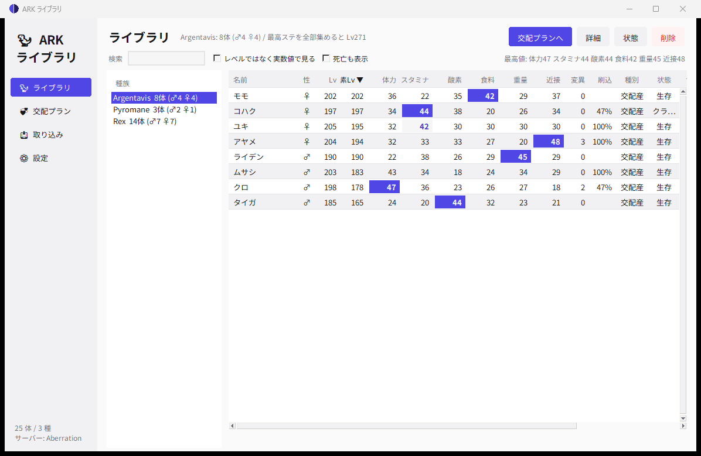
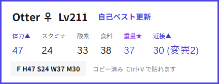
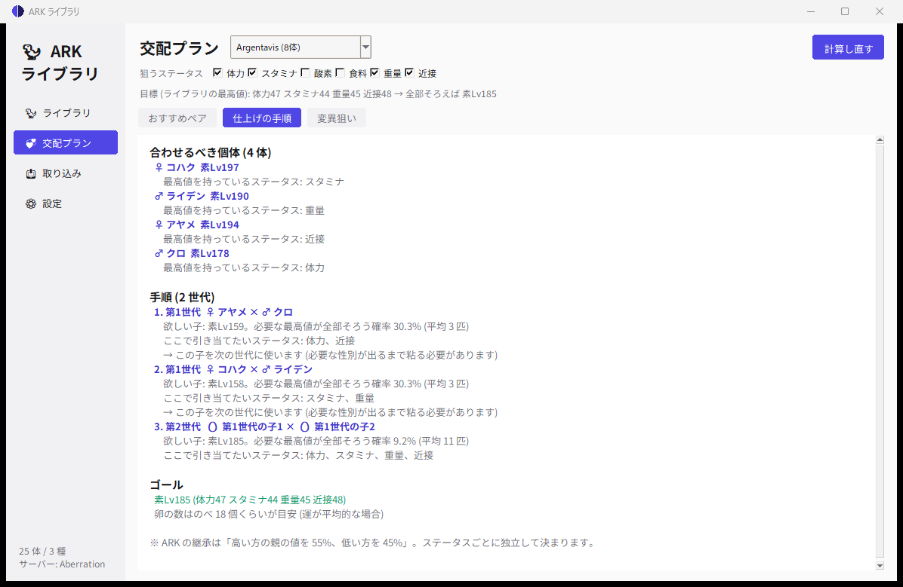

# ARK ライブラリ

ARK: Survival Ascended の生物を、ゲーム内の「恐竜のエクスポート」から取り込んで
管理する Windows デスクトップアプリ。ステータスのレベル内訳を割り出して一覧にし、
**最高ステータスの個体を作るにはどれとどれを掛け合わせればいいか**を出す。



エクスポートした瞬間に自動で取り込み、名前をクリップボードに入れて、
画面にステータスを数秒だけ出す。自己ベストが出たら音で知らせる。



## 入れかた

[リリース](https://github.com/Simohayhe/ark-library/releases/latest) から好きなものを。

| ファイル | どんなとき |
|---|---|
| `ArkLibrary-x.y.z-setup.exe` | **ふつうはこれ**。スタートメニューに入り、Windows起動時に自動で開く設定もできる |
| `ArkLibrary.exe` | インストールしたくないとき。1 ファイルで動く |
| `ArkLibrary-x.y.z-win64.zip` | フォルダ版。展開して置くだけ。起動がいちばん速い |

インストーラは**管理者権限を要求しない** (`%LOCALAPPDATA%\Programs\ArkLibrary` に入る)。
アンインストールしても、取り込んだライブラリは残る (消すかどうかは聞かれる)。

更新は **設定 → 更新を確認** から。新しい版があればその場で入れ替えて再起動する。
インストーラで入れたなら setup.exe を、そうでなければ exe か zip を自動で選ぶ。

ソースから動かす場合 (Python 3.12 + tkinter のみ。追加ライブラリなし):

```
python ark_library.py        (または 起動.bat)
```

---

## 使い方

### 1. サーバーの倍率を登録する (最初に 1 回)

「設定」→「自分のサーバーから読む」。このPCの `C:\ArkServers\<マップ名>\...\Game.ini`
を自動で見つけて読む。他所のサーバーで ini が貰えないときは、**表を直接書き換える**
(たとえば GorillaArk は「公式相当 ＋ 重量のテイムLv だけ 2 倍」)。

**ここが合っていないとステータスの逆算が必ずずれる**(解なしになる)。
エクスポートに入っているのは表示値だけで、レベルの内訳は入っていないため。

### 2. ゲーム内でエクスポートする

生物のインベントリを開いて「恐竜のエクスポート」。ファイルはここに増える。

```
C:\Program Files (x86)\Steam\steamapps\common\ARK Survival Ascended\ShooterGame\Saved\DinoExports\
```

### 3. 取り込む

既定で**自動取り込みが入っている**ので、ゲーム内でエクスポートすれば勝手に入る。
まとめて読み直したいときは「取り込み」→「新しいぶんを取り込む」。
フォルダは自動検出する。

同じ生物を何度エクスポートしても、ゲーム内 ID で同じ個体と分かるので重複しない
(内容は新しい方に更新される)。

### 4. 見る・組ませる

- **ライブラリ** … 種族ごとの一覧。列ごとの最高値に色が付く。行をダブルクリックで詳細。
- **交配プラン** … 下記。

---

## 取り込んだ瞬間にやること

「取り込み通知」画面で設定する。アプリを立ち上げておけば、取り込み画面を開いて
いなくても動く。

### 自動取り込み
DinoExports を数秒ごとに見張って、増えた瞬間にライブラリへ入れる。
書き込み途中のファイルを掴まないよう、出来たてのファイルは 1 回見送る。

### 名前をクリップボードへ

    M H47 S24 W37 M26
    ^ 性別          ^ 近接攻撃力のレベル

取り込んだ瞬間にこの文字列を作ってクリップボードに入れる。ゲームに戻って
名前欄に Ctrl+V で貼るだけ。入れるステータス・性別を付けるか・変異の印は
設定で変えられる。レベルは **野生 + 変異** (交配で子に渡る値)。

作り方は 3 つから選べる。

| 作り方 | 出てくる名前 | 使いどころ |
|---|---|---|
| ぜんぶ | `M H47 S24 O0 F0 W37 M26` | ふつう |
| ゼロだけ | `M O0 F0` | ゼロ狙いの系統。どこまで掃除できたか一目で分かる |
| OF (変異数) | `M 23 (20/3)` | オーバーフロー系統。変異カウンタと性別だけ |

OF の括弧は父側 / 母側の内訳。どちらが 20 未満かで次に掛ける相手が決まる。

ゲーム内で名前が付いていない個体は、この名前でライブラリに登録する
(オフにもできる)。

### オーバーレイ
ゲームの上に数秒だけ出る。既定 5 秒。次を取り込むと前のは即座に消えて
差し替わる。**フォーカスは奪わない**ので、出ている間もそのまま操作できる。

最高記録が出たステータスには印が付く。

| 印 | 意味 |
|---|---|
| ▲ | 今までのライブラリの最高を**超えた** |
| ★ | 今の最高と**同じ** |

ARK の表示設定が「フルスクリーン(専用)」だと Windows の仕様でどんな窓も
上に出せない。「ウィンドウ(フルスクリーン)」にすれば出る。

### 音 (4 種類)

| 場面 | 既定の音 |
|---|---|
| 取り込み成功 | ぽん |
| 取り込み失敗 | ぶぶー |
| 自己ベスト更新 (今までのどれよりも高い) | ファンファーレ |
| いまの最高と同じ | ちりん |

内蔵音はアプリが自分で合成して作るので音源ファイルは要らない。
自分の mp3 / wav に差し替えることもできる。

比べる相手は「同じ種族・同じサーバーの、生きている自分以外の個体」。
同じ生物を何度エクスポートしても、自分自身とは比べないので判定は変わらない。

---

## 交配プランの中身

### 狙い方 (ステータスごとに 3 段階)

上のチップを押すたびに切り替わる。

| 表示 | 意味 |
|---|---|
| ↑ | **最高**を狙う (体力・近接など) |
| ↓ | **ゼロ**を狙う (酸素・食料など) |
| — | 気にしない |

ゼロ狙いが要るのは、レベル上限に余裕を作りたいときや、変異を乗せる枠を空けたいとき。
「まとめて」から次のプリセットも選べる。

- **最高ステ狙い** … 全部 ↑
- **実用型 (酸素・食料をゼロ)** … 酸素と食料だけ ↓
- **Lv1個体 (全ステゼロ)** … 全部 ↓。まっさらな素体を作るモード

継承は「**高い方**の親を 55%、低い方を 45%」なので、**ゼロ狙いのステータスは
欲しい方が出る確率が 45%** になる。↑ と ↓ が混ざったペアの確率は
0.55 と 0.45 を掛け合わせて出している。

### おすすめペア
今いる個体の総当たり。並びは「最良の子のレベル」順。

| 列 | 意味 |
|---|---|
| 最高ステ | 最良の場合に、その子がライブラリ最高値をいくつ持つか |
| 最良の子 | 両親の良い方を全部引いたときの素レベル |
| 期待Lv | 平均するとこのくらい (0.55×高い方 + 0.45×低い方) |
| 当たり率 | 最良の子が出る確率。両親で値が違うステータスの数を n として 0.55ⁿ |
| 平均何匹 | 1 ÷ 当たり率。この数だけ孵せば平均 1 匹当たる |
| 変異率 | この交配で変異が 1 回以上起きる確率 |

### 仕上げの手順
ライブラリの最高値を **1 匹に集めきる**までの段取り。




1. ステータスごとの最高値の持ち主を拾い、いちばん少ない頭数で全部を賄える
   組み合わせを選ぶ (集合被覆)
2. その個体たちをトーナメント式に掛け合わせる
3. 各手で「必要な最高値が全部そろう確率」を出す

ここでの確率は**最高値に関わるステータスだけ**を数える。最高値に届かない
ステータスがどちらの親から来ても、あとの世代で上書きされるので関係ないため。

### 変異狙い
完成個体を崩さずに変異を足せるペア。変異カウンタが 20 以上の親からは
変異が出にくくなるので、そこも表示する。

### 色
色は**領域ごとに独立して、どちらかの親の色をそのまま**受け継ぐ (半々)。混ざらないし
中間色も出ない。だから狙った色を出すには、その色を持つ親を用意するしかない。

領域ごとに「ライブラリにある色」が色見本で並ぶので、狙う色を押して選ぶと、
その色が出せるペアを確率の高い順に出す。

- 両親ともその色 → **確定** (100%)
- 片方だけ → 五分五分 (50%)
- どちらも持っていない → そのペアでは出せない (一覧に出さない)

### 計算の根拠 (ARK の仕様)

- ステータスごとに独立して、**高い方の親の値を 55%**・低い方を 45% で継承
- 継承されるのは「野生レベル + 変異レベル」。振った強化レベルは渡らない
- 変異は 1 回の交配で最大 3 ロール・各 2.5% → 1 回以上起きる確率 約 7.3%
- 変異が起きるとランダムな 1 ステータスに **+2 レベル**
- 変異カウンタが 20 以上の側からは新しい変異が出にくい

---

## 取り込めるファイル

| 種類 | 拡張子 | レベルの内訳 |
|---|---|---|
| ARK 標準の「恐竜のエクスポート」 | `.ini` | 入っていない → 表示値から逆算する |
| Export Gun (Mod) | `.sav` / `.json` | **入っている** → 逆算不要で確実 |

Export Gun のサーバー倍率ファイルも読める (設定 →「Export Gun の倍率ファイル」)。

### 逆算について知っておくこと

- **交配産**はテイム効率 100% 固定なので素直に解ける。
- **テイム個体**は効率がファイルに入っていない。効率が効くステータス
  (体力・近接) の表示値から逆算して当てにいく。
- まれに**レベルの内訳が一つに決まらない**ことがある (表示値が丸められているため)。
  その個体は一覧で色が変わり、詳細に警告が出る。Export Gun で取り直せば確定する。
- **変異カウンタ (何回変異したか)** は、どちらのエクスポートにも入っている
  (父側・母側の 2 つ)。名前の「OF」モードはこれを使う。
- **どのステータスが変異したか**は入り方が違う。
  - Export Gun … ステータスごとの変異レベルが**そのまま**入っている
  - 標準エクスポート … 入っていない。両親がライブラリに居れば
    「親より 2 レベル高い = そこに変異」と分かる。居なければ野生レベル扱い。
    レベルの合計は変わらないので、交配プランの結果には影響しない。

---

## 実機での確認

実際のエクスポート (ASA / 日本語クライアント) で確認済み。

```
[Dino Data]  … DinoID1/2, DinoClass(末尾 _C), bIsFemale, TamerString, TamedName,
                ImprinterName, BabyAge, CharacterLevel, DinoImprintingQuality
[Colorization]          … ColorSet[0..5]
[Max Character Status Values] … 12 行。**キー名は日本語**(体力/スタミナ/…)で並び順が意味を持つ
[Dino Ancestry]         … DinoAncestorsCount, DinoAncestorsMale
```

ここで分かった注意点:

- セクション名は英語のまま、**キー名だけ翻訳される**。だから並び順で読む。
- `BabyAge=1` は**成体のテイム個体にも書かれる**。これを交配産の印にしてはいけない。
- 近接攻撃力・移動速度は 100% からの増分 (`近接攻撃力=1.4627` → 246.3%)。

確認に使った個体 (カワウソ Lv211、名前が `F H47 S24 W37 M26`) は
`tools/fixtures/real_asa_otter.ini` に置いてあり、`tools/test_import.py` が
毎回この実ファイルを読み戻して「体力47 スタミナ24 重量37 近接26 / 強化は重量に5 /
テイム効率95%」を復元できるか検算している。

## 制限

- **Mod の生物は非対応**。種族データが ARKStatsExtractor 由来のため、
  そこに無い生物は「種族が分かりません」で弾かれる。
- ASA 基準。ASE のエクスポートも形は同じだが、移動速度の扱いなどが違う。

---

## 中身

```
ark_library.py        起動口
arklib/               計算とデータ (UI に依存しない)
  ark.py              ステータス番号などの定数
  stats.py            ステータス値の計算
  species.py          種族データ + サーバー倍率の適用
  multipliers.py      サーバー倍率 (Game.ini の読み取り)
  extractor.py        表示値 → レベル内訳の逆算
  extraction.py       取り込み用のラッパー (テイム効率の逆算つき)
  solver.py           倍率が分からないサーバー向けの倍率逆算
  creature.py         個体データ
  library.py          SQLite の永続化
  breeding.py         交配プラン (本体)
  naming.py           M H47 S24 W37 M26 の組み立て (ゼロだけ / OF モードも)
  colors.py           色 ID と色領域 (RGBA から色 ID を当てる)
  records.py          自己ベスト更新 / 最高と同じ の判定
  sounds.py           音の合成と再生 (ふわふわタイマーから流用)
  paths.py            ARK インストール先・エクスポート先の検出
  updater.py          GitHub のリリースを見て自分を入れ替える
  importers/          ini / Export Gun の読み取り
ui/                   tkinter の画面
  theme.py            角丸ウィジェット (ふわふわタイマーと同じもの)
  table.py            セル単位で色を付けられる一覧表
  overlay.py          取り込んだ瞬間に出る、触れない窓
  autoimport.py       見張り → 取り込み → 名前コピー → 音 → オーバーレイ
  appicon.py          アイコン (棒グラフ)
  update_dialog.py    「更新を確認」の中身
data/species.json     種族データ 772 種 (うち ASA 579 種)
data/colors.json      色 100 色と、種族ごとの色領域 1036 種
tools/                テストと開発用
installer/            Inno Setup のインストーラ定義
```

データベースは `%LOCALAPPDATA%\ArkLibrary\library.db`。

### テスト

```
python tools/test_import.py    取り込み〜逆算〜交配プランの通し (52 件・実機ファイル含む)
python tools/test_alerts.py    名前の組み立てと記録判定 (20 件)
python tools/test_goals.py     狙い方 (最高/ゼロ)・名前のモード・色 (35 件)
python tools/smoke_ui.py <db>  画面・ダイアログ・自動取り込みの通し
python tools/seed_demo.py <db> 動作確認用のデモデータを作る
python tools/build.py          exe をビルドする (onefile / zip / setup.exe)
python tools/make_ico.py       アイコンを作り直す
python tools/build_color_db.py 色データを作り直す
```

---

## 出どころ

ステータス計算・逆算の考え方と種族データは
[ARKStatsExtractor](https://github.com/cadon/ARKStatsExtractor) (MIT License, (c) 2015 cadon)
を Python に移植・変換したもの。交配の確率などの定数も同プロジェクトの `Ark.cs` に合わせてある。
UI はこのアプリの独自実装。
